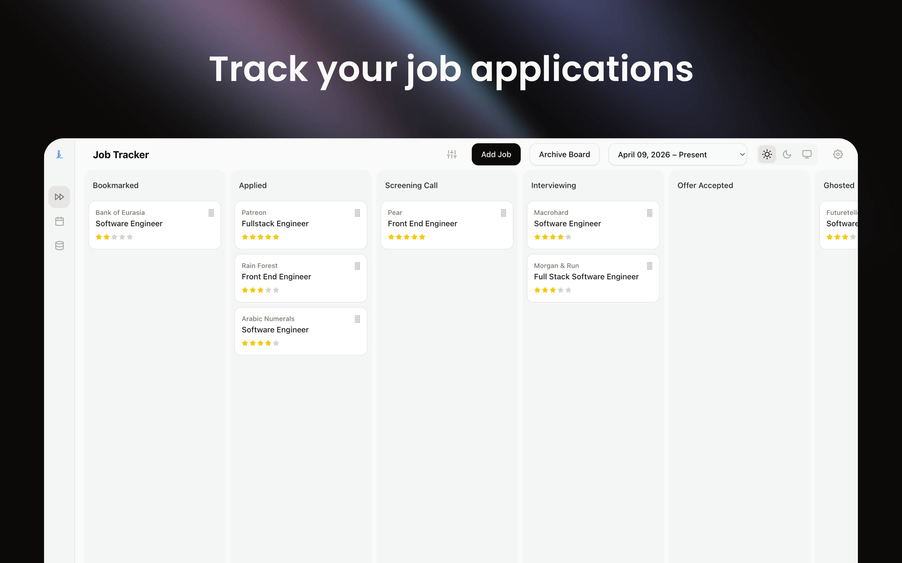
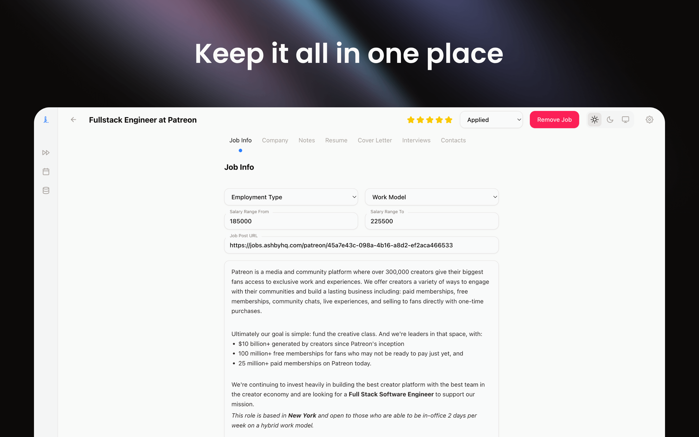
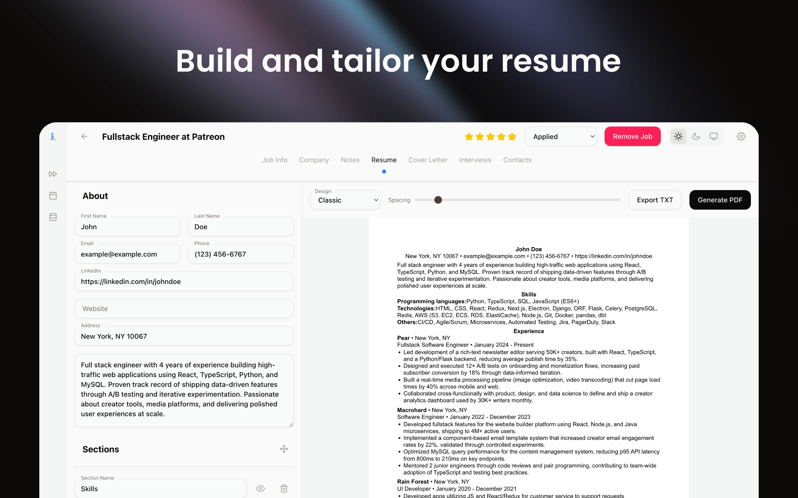
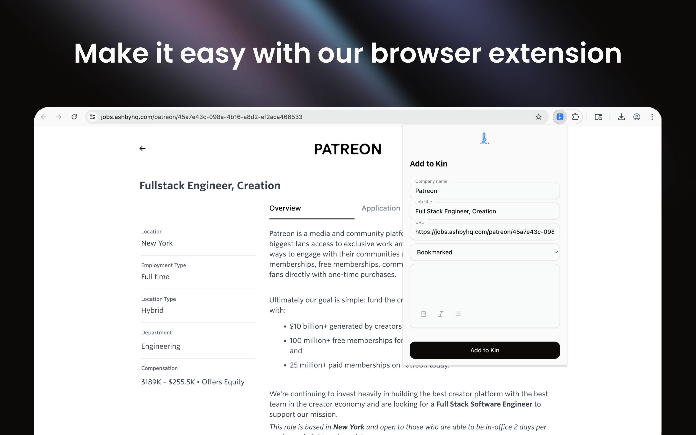
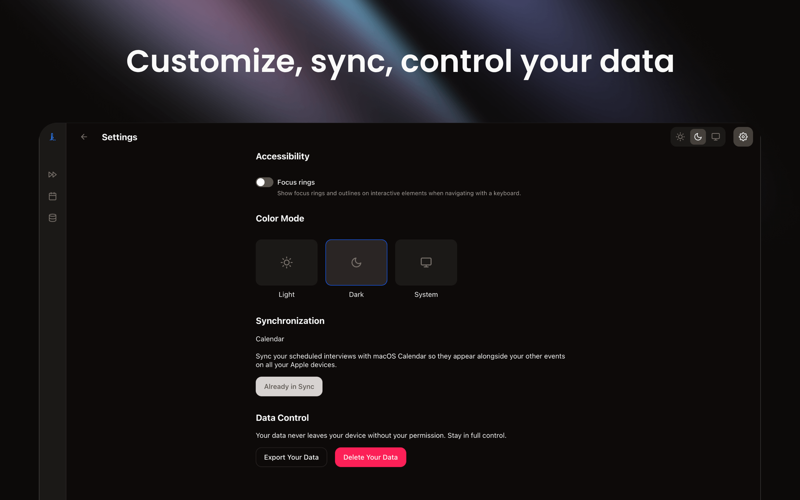

<div align="center">
  
</div>

<div align="center">
  
</div>

<div align="center">
    <strong>
      <h2>Kin: Job Search Companion</h2>
    </strong>
</div>

<div>
  <p><b>Kin: Job Search Companion</b> is a free, offline-first, and open-source desktop app that makes it easy to organize and manage your job search. Your data never leaves your device, so you stay in full control over it.</p>
  <p>Kin is an alternative to web-based services like <b>Teal, Huntr, Simplify, and others.</b></p>
</div>

## Features

|                                    |                                    |
| ---------------------------------- | ---------------------------------- |
|  |  |
|  |  |
|  |  |

- Track your job applications on a Kanban board
- Keep everything in one place: resumes and cover letters you applied with, notes, contacts, and interviews
- Create master resume and cover letter, and tailor them for each job
- Avoid applying to the same company twice. The app will warn you if you do
- Blocklist companies you never want to work for, and keep track of all companies and people you've interacted with
- Streamline your job search with a Google Chrome extension
- When you’re done, simply delete your data. You stay in full control so it never ends up on the market

## Tech Stack

- pnpm (Monorepo)
- Electron
- Vite
- React
- SQLite + Drizzle ORM
- Tailwind CSS

## Get Started

### Requirements

- Node.js (>=23.11.1, <=25.9.0)
- pnpm (>=10.33.0)

### Steps

Clone the repository:

```sh
git clone git@github.com:ruslanora/kin.git
```

`cd` into the project folder and install all dependencies:

```sh
pnpm i
```

To start the app in dev mode, run:

```sh
pnpm app:start
```

To build your own copy, run:

```sh
pnpm app:make --arch <target_architecture> --platform <target_platform>
```

For example:

```sh
pnpm app:make --arch arm64 --platform darwin
```

Now, unpack the build and add it to your apps. You can find the build in `apps/desktop/out/`.

To build the extension, run:

```sh
pnpm ext:build
```

You can add the extension by following [this guide](http://support.google.com/chrome_webstore/answer/2664769). You can find the build in `apps/extension/dist/`.

## Contributing

Thank you for considering contributing to Kin! The contribution guide [can be found here](CONTRIBUTING.md).

## Code of Conduct

In order to ensure that everybody is welcome, please review and abide by the [Code of Conduct](CODE_OF_CONDUCT.md).

## Security

Please review our [security policy](SECURITY.md) on how to report security vulnerabilities.

## License

Kin: Job Search Companion is open-sourced software licensed under the [AGPL-3.0 license](LICENSE).

## Support

<div align="center">
  <p>If you like what I'm building, buy me a coffee so I can build faster.</p>
  <a href="https://buymeacoffee.com/ruslanora" target="_blank">
    
  </a>
</div>
